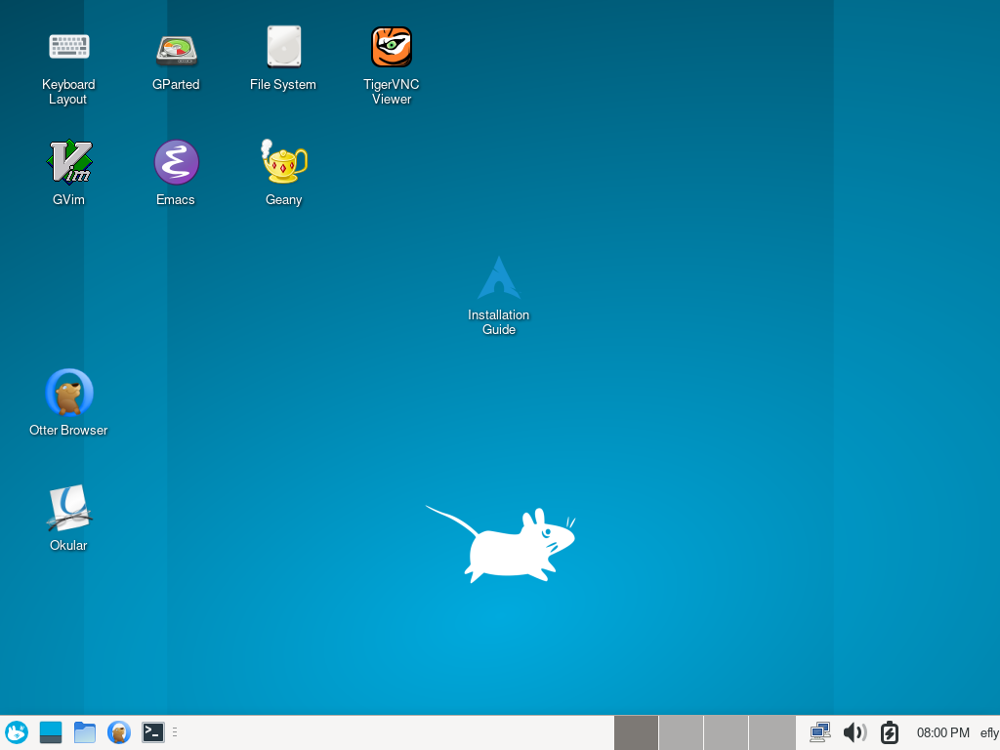

**[Docs](docs/README.md) - [Packages](https://github.com/flying-dude/curated-aur)**

A graphical live system based on Arch Linux.
Suitable for installing Arch Linux or as a rescue system for computers without a working operating system.
How to [flash](docs/flash.md) a USB stick?

<p align="center">
<b><a href="https://github.com/flying-dude/efly/releases/download/latest/efly-live.rom">efly-live.rom</a></b>
</p>



---

The image `efly-live.rom` is a read-only, bootable raw disk image. It will keep changes in a temporary file system when booting. But on reboot, it will reset to a clean state and changes are lost.

The image will currently only boot in UEFI mode (which is standard for all modern PCs).

If you have a USB stick plugged in and it is available on device node `/dev/sdX`, you can write it to the stick as follows (this will wipe all data currently on the stick):

```
$ sudo cp efly-live.rom /dev/sdX
$ sync # wait until kernel finished writing to the stick
```

---

Install `efly` on your Arch Linux system and create custom images:

```
wget https://raw.githubusercontent.com/flying-dude/curated-aur/main/pkg/efly/PKGBUILD
makepkg --syncdeps --install
efly img --overlay-size 10G # create a read-write disk image
efly qemu --uefi out/efly-live.img
```
