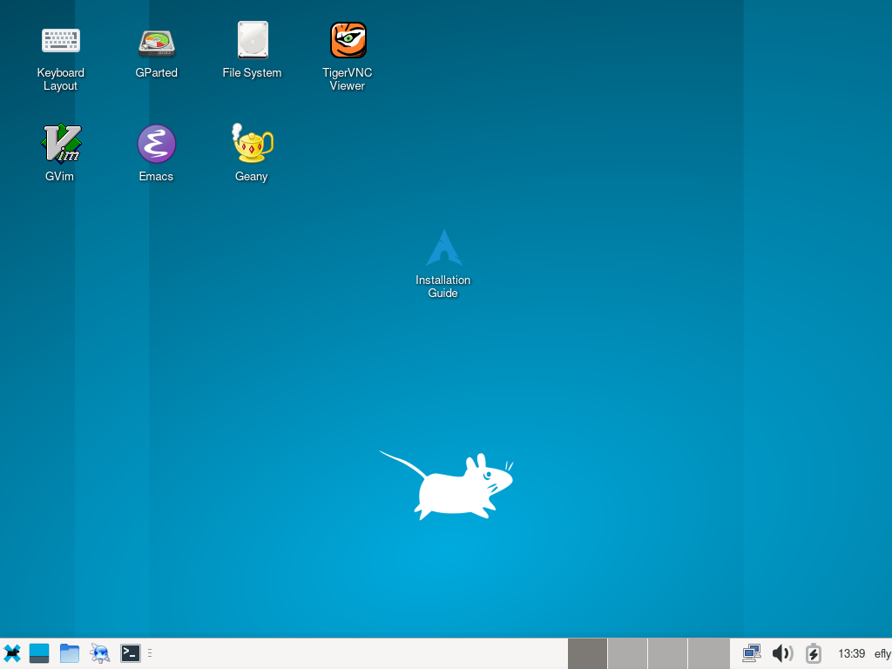

A graphical live system based on Arch Linux.
Suitable for installing Arch Linux or as a rescue system for computers without a working operating system.
How to [flash](docs/flash.md) a USB stick?

The image in [iso format](https://en.wikipedia.org/wiki/Optical_disc_image) has a volatile root file system, which deletes all changes on reboot.
The second option is a [raw disk image](https://en.wikipedia.org/wiki/IMG_(file_format)) with persistent storage.
It will retain changes among reboots.

<p align="center">
<b><a href="https://github.com/flying-dude/efly/releases/download/latest/efly-live.iso">iso</a></b> | <b><a href="https://github.com/flying-dude/efly/releases/download/lat
est/efly-live.img">img</a></b>
</p>

```
sudo pacman --sync python-docopt dosfstools e2fsprogs squashfs-tools gptfdisk
git clone https://github.com/flying-dude/efly
cd efly
./scripts/efly-img
truncate --size=10G img/out/efly-live.img
./scripts/efly-qemu --uefi img/out/efly-live.img
```


